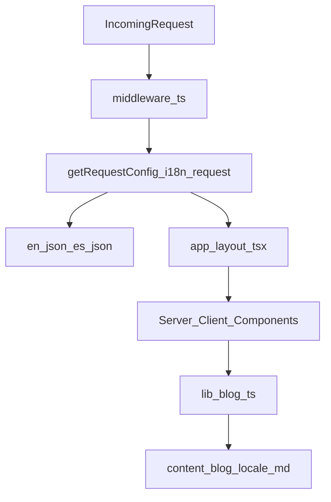

# Hidden-Locale i18n & Blog Localization Plan

## Overview

- **Goal**: Remove `/[locale] `from routes, keep URLs like `/blog/hello-world`, and still serve fully localized UI + blog content for `en`/`es` with great DX.
- **Approach**: Keep `next-intl` (good DX, already wired), but stop using its route-based i18n. Instead, resolve locale via cookie + `Accept-Language`, provide it app-wide from the root layout, and adapt the blog system to load locale-specific markdown while keeping shared slugs.

## Architecture Decision

- **Keep `next-intl`**:
  - Already integrated across navigation, events, guestbook, etc. (`messages/en.json`, `messages/es.json`).
  - Provides type-safe `useTranslations`, ICU messages, and good server/client ergonomics.
  - The main annoyance today is the routing layer (`[locale]` segment + `defineRouting`), which we can remove while keeping the translation primitives.
- **Hidden-locale routing**:
  - URLs have **no explicit locale** segment: `/`, `/blog`, `/blog/hello-world`, `/events/...`.
  - Locale is chosen by **cookie** (user preference) with **`Accept-Language`** as a fallback on first visit.
  - `html[lang]` and all translations are driven from this resolved locale.
- **Blog localization** (based on your "shared slug" preference):
  - Blog URLs remain `/blog/{slug}` for all languages.
  - Content (title, summary, body, meta) is localized per-locale, selected using the same locale resolution as the rest of the app.

## Target State (High-Level)

- **Routing**
  - `app/layout.tsx`: Single root layout sets `lang` using `next-intl`’s `getLocale()`.
  - `app/[locale]/... `is **removed**; all main routes live directly under `app/(main)` (or similar), with **no `locale` in `params`**.
- **Locale resolution**
  - `i18n/request.ts`: Implements `getRequestConfig` that:
    - Reads a `locale` cookie (e.g., `wm_locale`).
    - Falls back to `Accept-Language` header (en/es) or default `en`.
    - Loads `messages/{locale}.json`.
  - No dependency on `routing`’s `[locale]` segment; `requestLocale` is computed purely from cookie/header.
- **Client & navigation**
  - `i18n/routing.ts` and `i18n/navigation.ts` are no longer used for path generation.
  - All links use `next/link` with locale-agnostic paths (e.g., `href="/blog"`).
  - A small **language switcher** component updates the locale cookie (and refreshes/redirects) to change language without touching URLs.
- **Blog**
  - Files follow a pattern like `content/blog/hello-world.en.md` and `content/blog/hello-world.es.md` (shared slug, per-locale content).
  - `lib/blog.ts` APIs accept a `locale` argument and:
    - Try `${slug}.${locale}.md`, fall back to `${slug}.en.md` if missing.
    - Return localized `title`, `summary`, `contentHtml`, `readingTimeText`, etc.
  - Date formatting uses the current locale instead of hard-coded `en-US`.

## Step-by-Step Changes

### 1. Simplify i18n config to cookie-based locale resolution

- **Files**: [`i18n/request.ts`](./i18n/request.ts), [`i18n/routing.ts`](./i18n/routing.ts).
- **Changes**:
  - Stop using `defineRouting` as the source of truth for locale detection; keep only the simple locale list if needed.
  - In `i18n/request.ts`, re-implement `getRequestConfig` to:
    - Inspect `cookies()` (or `request.headers`) for a `wm_locale` value.
    - If absent, parse `Accept-Language` for `en`/`es` preference.
    - Validate against supported locales and fall back to `"en"`.
    - Import `messages/${locale}.json` as today.
- **Result**: `next-intl` always has a correct `locale` without relying on `[locale]` in the URL.

### 2. Move NextIntl provider to the root layout and remove `[locale]` segment

- **Files**: [`app/layout.tsx`](./app/layout.tsx), `[app/[locale]/layout.tsx](./app/%5Blocale%5D/layout.tsx)`, plus content routes under `app/[locale]/(main)`.
- **Changes**:
  - Update `app/layout.tsx` to:
    - Still use `getLocale()` for `lang`.
    - Fetch messages with `getMessages()` and wrap `{children}` in `NextIntlClientProvider` here instead of in `app/[locale]/layout.tsx`.
  - Remove `app/[locale]/layout.tsx` once the provider is lifted.
  - Move routes from `app/[locale]/(main)/... `to `app/(main)/...` (same structure, but no `locale` param in the folder name).
- **Result**: All pages get translations from the root, and routes like `/blog` and `/events` no longer contain the locale.

### 3. Remove route-level locale usage from pages/components

- **Files**: e.g. `[app/[locale]/(main)/blog/[slug]/page.tsx](./app/%5Blocale%5D/(main)/blog/%5Bslug%5D/page.tsx)` (to become `app/(main)/blog/[slug]/page.tsx`), other localized pages.
- **Changes**:
  - Update page `params` types to remove `locale`, keeping only what’s actually in the URL (e.g., `{ slug: string }`).
  - Remove `setRequestLocale(locale)` calls; `next-intl` will derive locale from the global config.
  - Replace any usage of `Link`/`useRouter` from `next-intl/navigation` with `next/link` and `next/navigation` equivalents.
- **Result**: Pages and components are simpler, and i18n concerns are handled centrally instead of per-route.

### 4. Implement a language switcher backed by cookies

- **Files**: new component under `components/common/`, plus possibly a small server action or route handler.
- **Changes**:
  - Create a `LanguageSwitcher` that:
    - Reads the current locale from `useLocale()` (from `next-intl`).
    - On change, calls a server action or `POST`/`GET` endpoint to set the `wm_locale` cookie.
    - Reloads or redirects to the same path after update.
  - Integrate this switcher into your existing navigation or footer using shadcn/ui primitives.
- **Result**: Users can change language without changing the URL, and the new choice persists across requests.

### 5. Introduce locale-aware blog content files

- **Files**: `content/blog/*.md`, [`lib/blog.ts`](./lib/blog.ts), `app/(main)/blog/[slug]/page.tsx`.
- **Changes**:
  - Adopt a naming convention for localized posts, e.g.:
    - `content/blog/hello-world.en.md`
    - `content/blog/hello-world.es.md`
  - In `lib/blog.ts`:
    - Add a `locale: string` argument to `getAllPosts` / `getPostBySlug` (or create new overloads), and prefer `${slug}.${locale}.md`.
    - Fallback to a default (`en`) if the localized file doesn’t exist.
    - Ensure `PostMeta` stays the same, but its fields are read from the locale-specific file.
  - In `app/(main)/blog/[slug]/page.tsx`:
    - Use `getLocale()` (server-side) to determine the current locale and pass it into `getPostBySlug`.
    - Keep the URL structure `/blog/{slug}` unchanged.
- **Result**: The same slug serves localized content while keeping a single, clean URL per post.

### 6. Make date and blog metadata locale-aware

- **Files**: [`lib/blog.ts`](./lib/blog.ts), `app/(main)/blog/[slug]/page.tsx`.
- **Changes**:
  - Update `formatDate` in `lib/blog.ts` to accept a `locale` argument and use `toLocaleDateString(locale, ...)`.
  - Pass the current locale wherever `formatDate` is used.
  - Optionally localize SEO metadata (e.g., description) based on the localized frontmatter.
- **Result**: Blog dates and metadata feel native to each language.

### 7. Cleanup & docs

- **Files**: remove unused i18n helpers (`i18n/routing.ts`, `i18n/navigation.ts` if fully unused), and update any internal docs.
- **Changes**:
  - Remove dead imports/usages of the old `createNavigation` API.
  - Add a short note to `README.md` (or your internal docs) explaining the new locale resolution (cookie + `Accept-Language`) and blog file naming scheme.
- **Result**: Future changes remain easy, and the i18n model is clear for anyone reading the code.